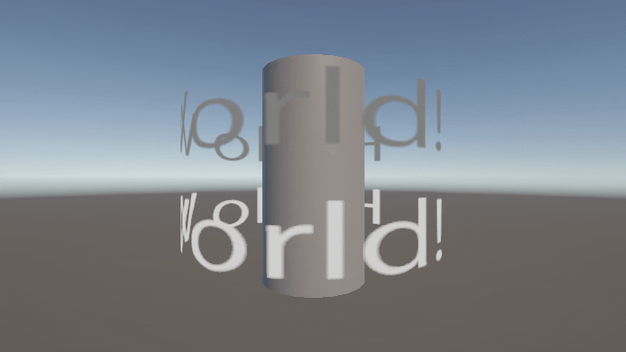
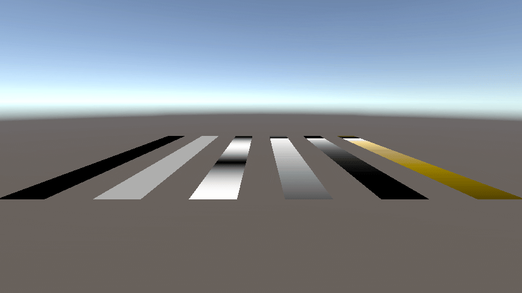
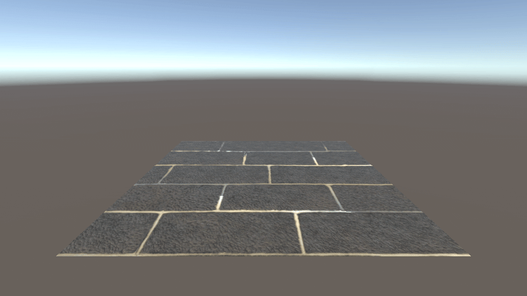
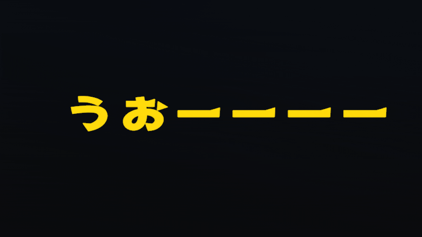

# はじめに
プログラムワークショップIVの管理用です

# 結果画像

- 工夫した点：
文字画像を透過で作りscene1のシリンダー型メッシュを平面に変形して平らで横に流れるアニメーションに
虹グラデーション配色に加工しました
　　　　　　　　　　　　　　　　

# 進め方

- 本リポジトリをforkしてください
- fork先のリポジトリを更新してください
- Unityのプロジェクトをsrc内で進めてください
- 結果を画面キャプチャして、画像としてリポジトリに追加して、上記のリンクから見られるようにしてください
- 完成したら本リポジトリのmainブランチにpull requestを投げてください
